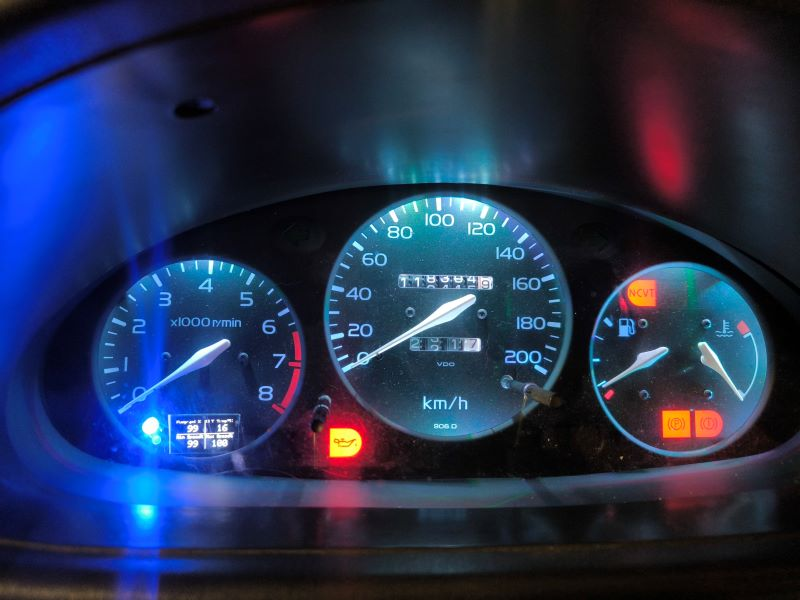

# NiBoCo
Boardcomputer and controller for a CWA pump for my Nissan Micra GA16DE project

# Why
I installed a GA16DE engine from a Nissan Almera in a Nissan Micra K11 1.0. Since this engine is much larger, there was no room for the V-belt drive of the water pump. Cutting out the frame was not an option for me, so the cooling system had to be converted to an electric pump. I chose a Pierburg CWA200 water pump, which is installed in some BMWs.

I also wanted to have an additional display in my speedometer for my Speeduino.
MielArrojado's project "speeduino-ardugauge" is just perfect.

https://github.com/MielArrojado/speeduino-ardugauge

So why not combine the two?

**This is a standalone version! There's no connection to Speeduino!**

# How is the cooling system set up?

Since there was no room for the belt drive of the water pump due to space constraints, and cutting into the frame for legal reasons was avoided, an electric coolant pump from BMW, an external thermostat from a Fiat 126, and a VW secondary pump for the heating circuit are used.

The system is controlled by an Arduino Nano and a bit of chicken feed.

The CWA200 main pump is controlled via a PWM (pulse width modulation) signal.
The secondary pump is also controlled via a PWM signal.

The speed and the corresponding flow rate are regulated directly by the coolant temperature. Visual feedback is provided via a display and an RGB LED in the instrument cluster. The control points can be adjusted using two potentiometers.

The radiator fan is also controlled by the controller.

# How is it regulated?

Temperature control is achieved via a total of 4 different temperature programs,
which are referred to as modes below. The currently active mode is indicated by the LED in the instrument cluster.

The system regulates to a target temperature (e.g., 85°C).

### Mode 1 (Warm-Up Pulse Mode)

If the coolant temperature is less than 25°C below the target temperature (60°C), the engine speed switches between an absolute minimum value of 10% (350 rpm) and the predefined lower reference point, which is set via the "Reference Low" potentiometer (e.g., 30%).

The pump then runs for 30 seconds at 10% speed and 4 seconds at 30% speed.

The secondary pump runs at approximately 60% speed.

This ensures a clean and rapid warm-up of the engine.

As feedback, the LED in the instrument cluster illuminates blue.

### Mode 2 (Warm-Up)

When the coolant temperature is between 25°C and 10°C below the target temperature (60°C-75°C), the pump speed is maintained at the predefined lower reference point.

The secondary pump is continuously ramped up to 100%.

As feedback, the LED in the instrument cluster lights up turquoise.

### Mode 3 (Normal Operation)

When the coolant temperature is higher than 10°C below the target temperature, the pump speed is controlled by a PID-styled controller.

The maximum operating speed can be set using the potentiometer "Reference High" (e.g., 90%).

The PID controller attempts to maintain the temperature at 85°C by adjusting the pump speed.

The secondary pump continues to run at 100%.

As feedback, the LED in the instrument cluster lights up green.

### Mode 4 (Overheating)

If the coolant temperature exceeds 98°C (target temperature +13°C), the speed of
both pumps is set to 100% to counteract further overheating.

This pump behavior also occurs if the connection to the pump is interrupted. (Fail-Safe Mode)
As feedback, the LED in the instrument cluster lights up red.

## Fan Control
At a set temperature of 90°C, the radiator fan is activated.

The hysteresis is 4°C.

## Afterrun control

When the ignition is switched off, the pump does not switch off immediately but continues to monitor the coolant temperature.

If the temperature is within the Mode 3 range, the pump continues to run for another 60 seconds to prevent potential hot spots in the engine.

# What else can it do?

The display also shows water temperature, oil temperature, vehicle voltage, pump status, and a few bit indicators.

It's located in the instrument cluster in place of the clock.

Operation is via three pushbuttons, which were originally intended for the clock (forward, back, enter).

The display has the following pages:

### Page 1:

Oil and water temperature display

### Page 2:

Vehicle voltage display

### Page 3:

Main pump status, such as setpoints, current speed, etc.

### Page 4:

Various indicators, such as fan running, after-run active, sensor fault, etc.

### Page 5:

Auxiliary pump status, such as setpoints, current speed, etc.

### Page 6:
Frames per second

Additionally, alarm messages are displayed when limit values ​​are exceeded.

By pressing and holding the Enter key, you can switch to a kind of test mode to manually control the pumps and fans.

# What's next?

Since this project has been working flawlessly in my car for 1.5 years, I consider it complete.

I might add an oil pressure sensor, but will that ever happen? We'll see what the future holds.

Feel free to build your own.

