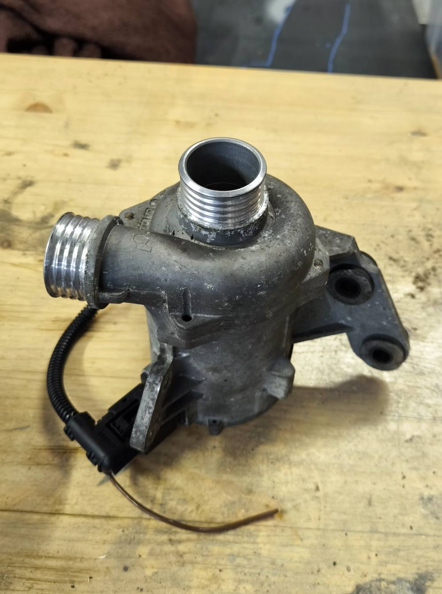

# NiBoCo
Boardcomputer and controller for a CWA pump for my Nissan Micra GA16DE project

# Why
I installed a GA16DE engine from a Nissan Almera in a Nissan Micra K11 1.0. Since this engine is much larger, there was no room for the V-belt drive of the water pump. Cutting out the frame was not an option for me, so the cooling system had to be converted to an electric pump. I chose a Pierburg CWA200 water pump, which is installed in some BMWs.

I also wanted to have an additional display in my speedometer for my Speeduino.
MielArrojado's project "speeduino-ardugauge" is just perfect.

https://github.com/MielArrojado/speeduino-ardugauge

So why not combine the two?

